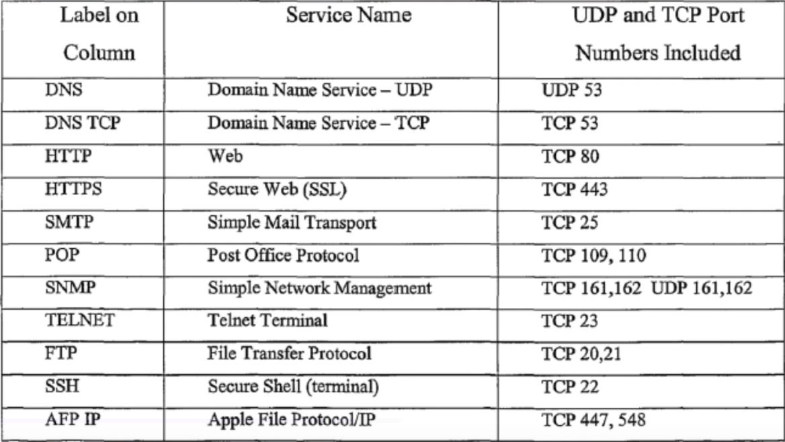
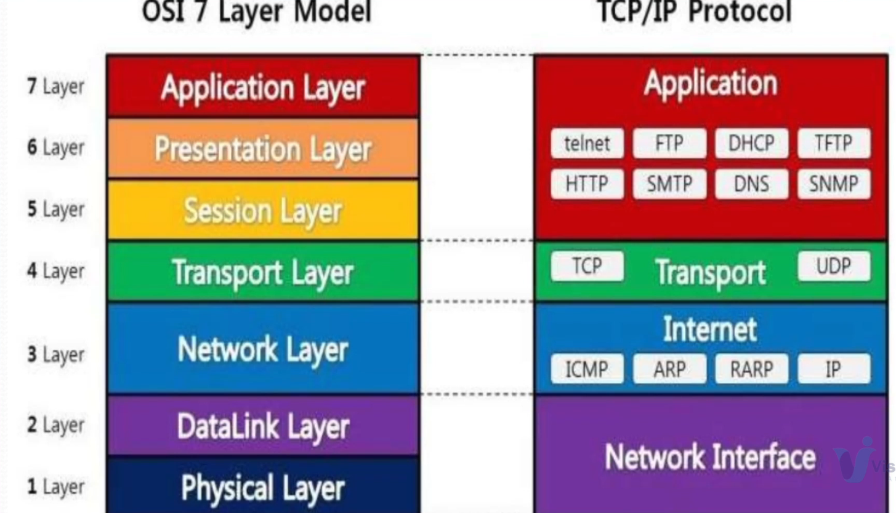

# Networking

- Networking is communication between 2 or more network interfaces
  - interfaces can be sim cards, wifi, ethernet etc.
- needed to make a network
  - 2 or more computers/devices
  - cablles as links or wifi
  - a network interfacing card (NIC) on each device
  - a computer that can understand communications, where they are meant to go and how to interpret those commands
  - Switches that are used for many network interfaces together
  - Routers to connect multiple networks together
  - OS that can show information to the user

## Summary of Layers

_this is a good summary of all the stuff in this section_

## ISO

### OSI Model

- this is the standard for networking so that developers can keep everything consistent
- this allows computers across the world to communicate with no issue
- ISO International Oraganization of Standardization has developed this standard
  - it is confusing but ISO made the OSI model
- OSI os Open system Interconnection
- ISO-OSI model is a seven layer architecture
  - Physical
  - Data Link
  - Network
  - Transport
  - Session
  - Presentation
  - Application
    - PDNTSPA
      - Please don't neuter that spare puppy Arron
- the basic elements of a layered model are
  - services
  - protocols
  - interfaces
- The service is a set of actions that a layer offers to another (higher) layer.
- A protocol is a set of rules taht a layer users to exchange information
- A interface is a communication between layers

### sending and recieving

- sender
  - the letter is written put in an envelope and dropped in the mailbox
    - this this high level because you know exactly what is happening because you are the one doing it
  - The letter is carried from the mailbox to the post office
    - this is a middle layer because you have a general idea that a person picks it up and drives it away but you don't know the specifics of what is happening, like organization
  - the letter is delivered to a carrier by the post office
    - this is a lower layer because you really don't know who the carrier is (USPS, driver, plane) or how they are moving it
- receiver
  - The letter arrives at a post office near the receiver
    - low level
  - The letter is carried from the post office to the mailbox
    - middle level
  - The letter is picked up, removed from the envelope, and read.
    - high level

- high levels are you uploading picture that you took
- middle levels would be breaking it down into computer info
- low level would be sending over the network with bit

### ISO Model

- The lowest level is the physical (cables, racks, and binary). In this layer it is in bits
- next is the data link, this makes sure that all of the data transfers successfully from one node to another. In this layer data is in frames
- network layer. data is assembled into packets that can be sent across networks. this layer uses IP addresses to send and recieve data
- trasport layer is responsible for the end to end delivery of a message and this is done in segments. most of this work is in the HTTP request from one user to another
- session layer, presentation layer and application layer are all presented as one layer, usually only one of these will trigger based on what you are sending the data to

### Layer Model

# Understanding Networks and IP

## Classifications of networks

### LAN

- local area network
- A close network can be access without internet
- sometimes involves physical connections
- good for security if it is seperated from WAN

### WAN

- Wide area network
- like the internet or VPN
- used to connect 2 terminal to each other over great distances

### MAN

- metropolitan area network - usually a city wide network
- this is still usually closed like a LAN but still covers a large area
- used to control and manage things like street lights, power, and emergency services

### CAN

- campus area network - up to a couple blocks
- used for office, school, or military
- this also covers the blutooth range since that is a smaller but still open network

## Switches

- Switches facilitate the sharing of resources by connecting together all of the devices, including computers, printers, and servers in a small business network
- routers are smaller versions os switches that connect devices locally with ethernet cords as well as with the internet (wan)
- At large businesses they use larger switch boards for things like server racks

## Routers

- A router recieves and sends data on computer networks but have the ability to combine mulitple networks together
- the one in your house connects your lan in your house to the wan called the internet

## Home Network

- the ISP give you an IP address that is given to you modem
- the modem connects to your router, which now has an internet IP and LAN IP
  - LAN IP: 192.168.0.1
  - WAN IP: appears as 64.185.133.91
- LAN will always have 192.168.x.x

## Private IP ranges

- These are reserved for different uses in lan only. These are not allow on the public network at all.
- Class A - 10.0.0.0 - 10.255.255.255
- Class B - 172.16.0.0 - 172.31.255.255
- Class C - 192.168.0.0 - 192.168.255.255

# Protocols

- a protocol is the formal specification that defines the procedures that must be followed when transmitting or receiving data.
- Protocols define the format, timing, sequence, and error checking used on the network

## TCP

#### e.g. FTP, HTTP, HTTPS

- reliable protocol
- connection oriented
- performs three ways handshake
- provision for error detection and retransmission
- most applications use TCP for reliable and guaranteed transmission

## UDP

#### e.g. DNS, DHCP, TFTP, ARP, RARP

- unreliable protocol
- connectionless
- much faster than tcp
- no acknowledgement waits
- no proper sequencing of data units
- suitable for applications where speed matters more than reliability

- every protocol will have different port numbers.
  - for example https is on port 443 and it tells your computer what to do with that communication

# Networking Commands

- sudo -i
  - you need root permissions to run these
- ifconfig
  - this will show you all of the active network interfaces
  - to run this command I needed to be in linux and install net tools
    - apt install net-tools
  - you should have 3
    - 10.x.x.x which is the router
    - 192.168.x.x this is the local
    - 127.0.0.1 this the local interface, what you ssh into
- ip addr show
  - this will show your own ip address
- ping <ip> : one of the IP from above
  - this will send packages to the ip and you can see if they have a connection
- vi /etc/hosts
  - at the bottom add:
- 192.168.40.12 db01 (or what ever your ip was from above)
- ping db01
- tracert <url|ip>
  - tracert www.google.com
  - you can watch every hop that the request makes to get the ip of that address.
  - this is usually used for testing connections to other IPs of a target IP that you want to check out
  - It lets you pin point why some connections might be slow. you can see that the delay comes from a point that you don't control and its not your fault
- netstat -antp
  - this will show all of the currently open ports in the machine
  - it will also show you PID of the connections and you can kill it like other PIDs
- ss -tunlp
  - this is just a little more detailed but the same as above
- nmap
  - you might need to install nmap
  - `apt install nmap -y`
  - _this command can be illegal to run on some sites so please only use it on your own machines for trouble shooting purposes_
  - this will scan all ips and tell you what port they are open at.
- dig <url>
  - dig www.google.com
  - it will tell you the ip and is used to show if the dns for the server is working or not
- nslookup <url>
  - nslookup www.google.com
  - this is just an older version of dig
- route
  - this will show you the gateways on the routing table
- arp
  - this will list all of the ips/hosts and show you the mac address
- mtr <url>
  - is the same trace but it happens live for you to watch. This is really nice for getting clear, live information about a request
  - this will also show you the packet losses and pings live too as update over time
- telnet <ip> <port>
  - this one is a little more involved
  - first we nmap db01
    - take the ip for it, (mine was 192.168.40.12)
    - check out the ports (mine was ssh 22)
  - try running telnet 192.168.40.12 3306 (this is the mysql port)
    - connection was made but the to the port but the HHost was nots allowed to connect
  - try running telnet 192.168.40.12 22 (this is the ssh port)
    - now it is working and lets you connect to the machine
  - it tells you but the connection can be closed with crtl+] then quit
